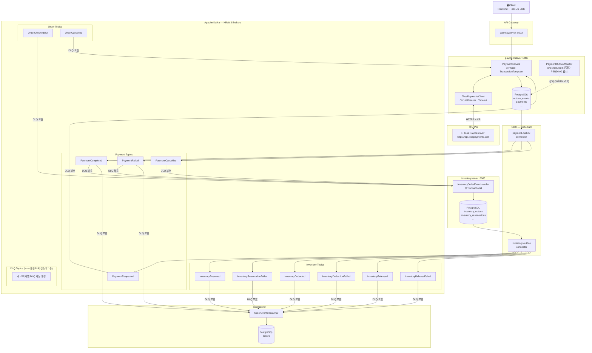
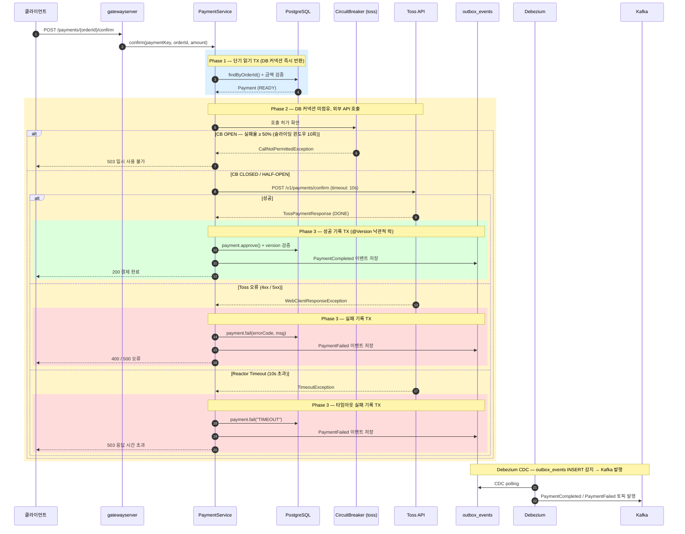
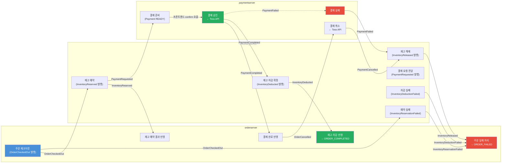
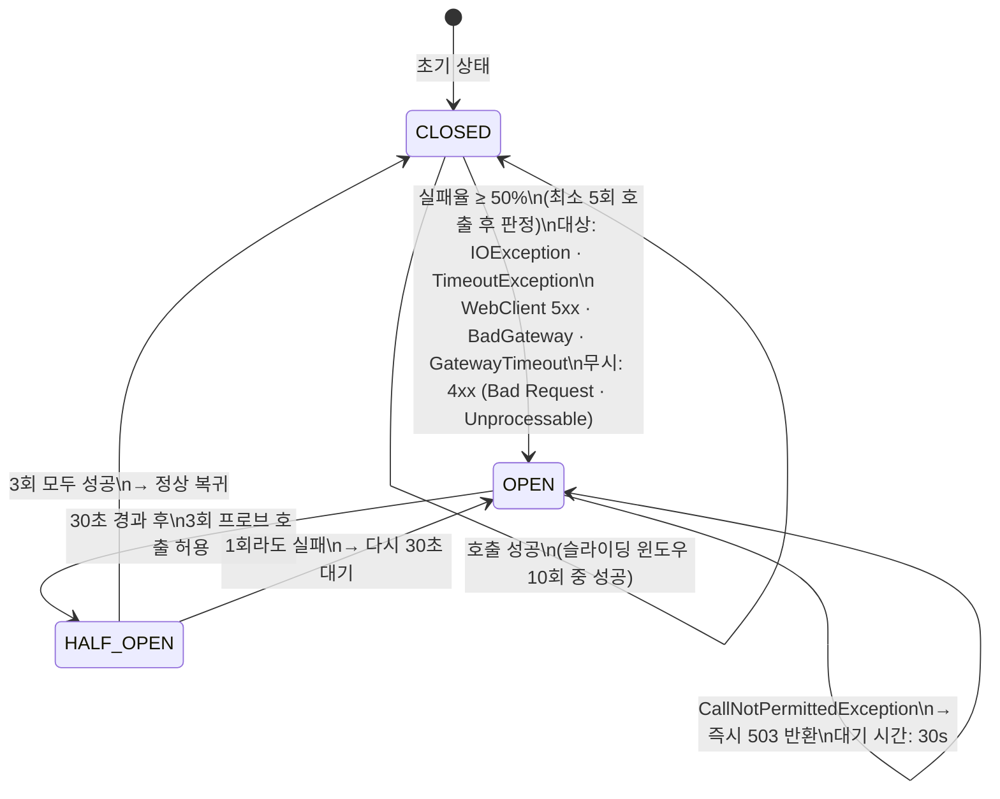
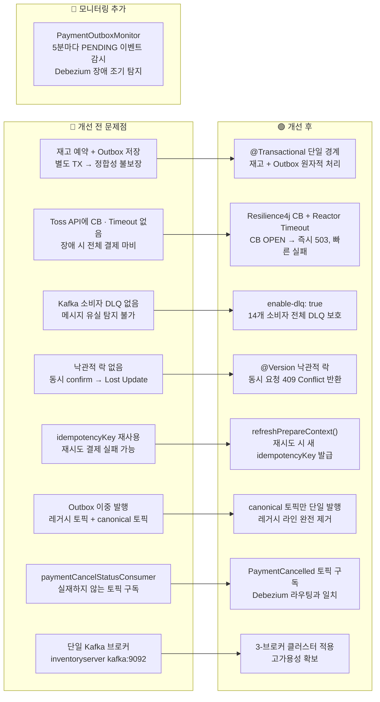

# 결제 시스템 아키텍처 다이어그램

---

## 1. 전체 시스템 구성도

---

## 2. 결제 확정 플로우 (3-Phase TX + Circuit Breaker)

---

## 3. 전체 이벤트 체이닝 플로우 (주문 체크아웃 → 최종 상태)

---

## 4. Circuit Breaker 상태 전이

---

## 5. 개선 사항 요약

